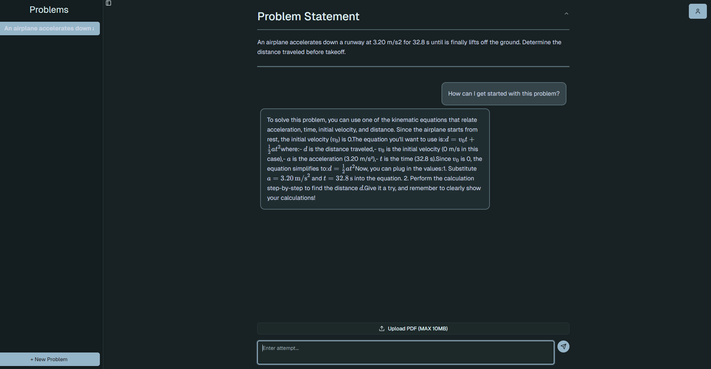

# Student Assistant
An experimental AI chatbot application leveraging Retrieval-Augmented Generation (RAG) and Large Language Models (LLMs) to provide context-aware answers from custom knowledge bases across persistent conversations

## Demo
Here is a demo [DOWN RIGHT NOW]: http://studentassistant.dev

## Tech Stack
### Frontend
- React + Vite
- Typescript
- React Router
- ShadCN

### Backend
- Node.js + Express
- Typescript
- PostgreSQL 
- Supabase
- Google OAuth
- OpenAI API
- Multer (file uploads)
- Redis (rate limiting)

### Deployment
- AWS EC2
- Docker

## Site

### Chat Interface
Minimalistic and intuitive chat UI for seamless interaction.

### Response Generation
Generates precise answers with cited sources (WIP).

### Document Processing
Efficiently ingests and vectorizes uploaded documents (PDF, TXT and MD are WIP) for retrieval.
